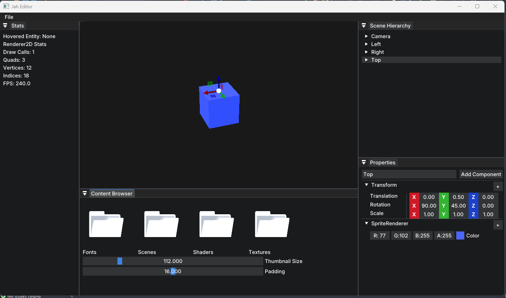

# Jah Engine



Jah Engine is a C++23 game engine inspired by [Hazel](https://github.com/TheCherno/Hazel).  
It provides a modern, lightweight framework for building 2D games with OpenGL.

---

## Features

### Current Features
- **2D Renderer**: Built with OpenGL
- **Scene System**: Play and Stop Button, Entities, Components, Serialization, Scene Hierarchy Panel, and Content Browser Panel
- **Mouse Picking**: Using framebuffer attachments for entity selection
- **Texture and asset management**
- **Input system**: Keyboard and mouse handling
- 2D physics system
- Circle rendering
- C# scripting support
- **Editor support**: Custom ImGui-based content browser and UI
- **Runtime support**: Dist configuration to ship games

### Coming Soon
- Sound Components
- Saving/Loading Textures
- Launcher
- Project System

---

## Getting Started

### Prerequisites
- C++23 compatible compiler
- Premake
- OpenGL 3.3+
- GLFW, GLAD, ImGui (included as submodules or downloaded)

### Build
1. Clone the repository:

```bash
git clone --recurse-submodules https://github.com/JordanDia/Jah.git
```

2. Run the GenerateProjects.bat script in the main directory. This will create project files for your compiler/IDE.

3. Open the generated project in Visual Studio IDE and build.
